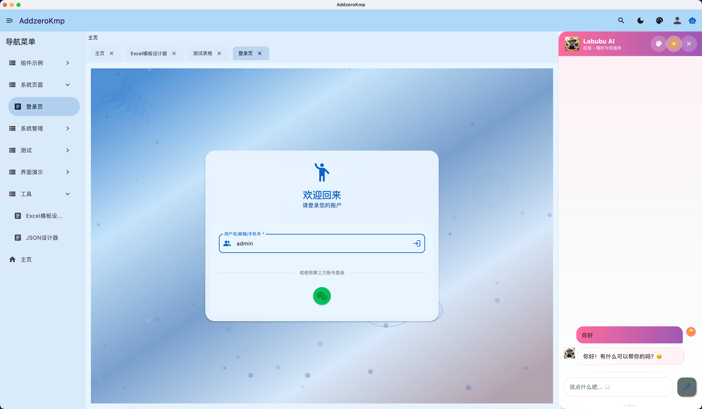
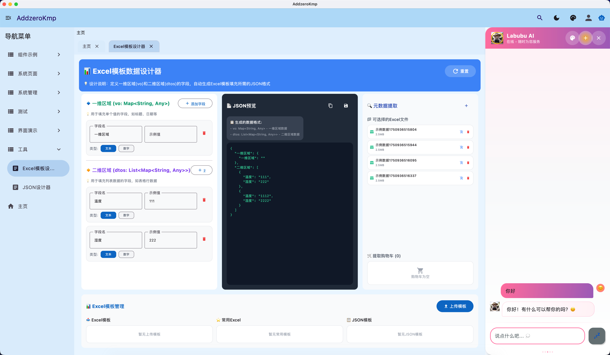
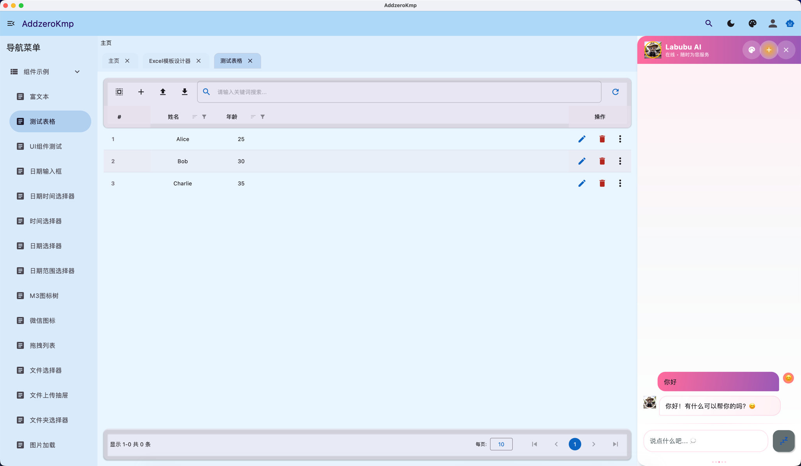
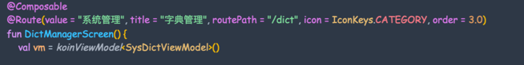

# KMP Jimmer 全栈脚手架

> 基于 Kotlin Multiplatform + Jimmer 的全栈开发脚手架，通过 KSP 实现前后端代码生成的完美一致性

## 🚀 技术栈

[](https://skillicons.dev)

**核心技术：** Kotlin Multiplatform •  Compose • Jimmer ORM • KSP • Spring Boot • PostgreSQL

## 📸 项目展示




## 环境准备

```shell
# add in your .zhsrc or .bashrc
export SERVER_HOST=localhost
export DB_PORT=5432
export DATABASE_NAME=postgres
export SCHEMA_NAME=public
export JDBC_USERNAME=postgres
export JDBC_PASSWORD=postgres
export EXCLUDE_TABLES=flyway_schema_history,vector_store,*_mapping

```
or powershell (notepad $profile)

```shell
$env:SERVER_HOST = "localhost"
$env:DB_PORT = 5432
$env:DATABASE_NAME ="postgres"
$env:SCHEMA_NAME = "public"
$env:JDBC_USERNAME = "postgres"
$env:JDBC_PASSWORD = "postgres"
$env:EXCLUDE_TABLES = "flyway_schema_history,vector_store,*_mapping"

```

## tips :暂未验证postgres以外类型数据库的元数据分析兼容性,自行验证JdbcMetadataExtractor这个工具类("自行适配,要改预编译")
## tips :目前Server模块需要SpringAI db推荐用PGVECTOR 
## tips :数据库会在第一次启动后端时自动初始化

[//]: # (## tips :目前这个项目在积极维护中,libs有一部分代码暂时没精力搞中央仓库让所有人通用&#40;要抽配置&#41;,后续项目完善了考虑写文档说明libs每个库的作用,总之libs是作者懒到极致的封装体现!)

## ✨ 核心特性

### 🎯 **一致性保证** - 单一数据源，多端同步

- **Jimmer 实体生成** (Backend) - 数据模型定义的唯一真相源
- **默认 Controller 生成** (Backend) - 标准化 CRUD 接口
- **网络 API 自动生成** - 解析 Controller 符号，自动生成类型安全的网络调用
- **同构体生成** (跨平台 Shared) - `SysUserIso` 等数据传输对象
- **字典/枚举生成** (跨平台 Shared) - `site.addzero.generated.enums`
- **矢量图标管理** - `IconKeys` 常量 + `IconMap` 映射
- **JDBC 元数据** (跨平台 Shared) - `site.addzero.jdbc.meta.jdbcMetadata`

### 🎨 **智能表单生成** - KSP 驱动的动态 UI

- **✅ 基于 Jimmer 实体的动态表单生成** - 包含完整校验逻辑和DSL自定义
- **🔄 策略模式架构** - 可扩展的字段类型支持
- **🎯 智能字段识别** - 根据字段名称和类型自动选择合适的输入组件
- **📱 多样化输入组件** - 整数、小数、金额、百分比、日期、邮箱、手机号等
- **💰 智能货币图标** - 根据货币类型自动显示对应图标（¥/$/€等）
- **🔍 RegexEnum 验证** - 统一的正则表达式验证体系
- **🏷️ @Label 注解支持** - 优先使用注解标签，回退到文档注释(即写代码注释编译时会当做表单label)
- **🎨 DSL自定义渲染** - 通过DSL代码块自定义任意字段的渲染方式
- **🔄 响应式状态管理** - 基于MutableState的自动UI更新
- **📦 多列布局支持** - AddMultiColumnContainer自动布局
- **🎭 条件渲染** - 支持基于业务逻辑的动态字段显示/隐藏

### 🎨 **ComposeAssist 响应式组件** - Vue风格的状态管理

- **✅ 响应式State生成** - 基于`mutableStateOf`的自动重组机制
- **🎯 参数打包** - 将组件参数打包为类型安全的State对象
- **🚀 Widget函数生成** - 只接受State参数的辅助组件
- **🧩 完整泛型支持** - 支持泛型函数和约束泛型
- **🔄 自动重组** - 修改State属性自动触发UI更新
- **📦 零样板代码** - 一个`@ComposeAssist`注解生成完整工具集

### 🌳 **树形组件设计** - 插槽重构理念

- **🎯 职责分离** - 头部和尾部插槽移除，用户在外部直接声明
- **🔧 内部插槽保留** - 只保留无法在外部切入的功能插槽
- **🎨 灵活布局** - 用户完全控制组件外部的布局和样式
- **⚡ 性能优化** - 减少不必要的插槽嵌套和重组

### 🧭 **路由导航系统**

- **路由表生成** (跨平台 ComposeApp) - `RouteTable`
- **路由常量** (跨平台 ComposeApp) - `RouteKeys`

## 🏗️ KSP 处理器架构

### 📦 **核心库模块** (`lib/`)

#### 🔧 **addzero-ksp-support** - KSP 工具支持库

这个模块是整个 KSP 代码生成体系的基础设施层，被其他所有 KSP 处理器模块依赖

#### 🔧 **addzero-ksp-support-jdbc** - JDBC 元数据支持

- JDBC 连接和元数据提取工具
- 数据库表结构分析
- 字段类型映射

#### 🎨 **addzero-entity2form-processor** - 动态表单生成器

- **FormByIsoProcessor.kt** - 主处理器，基于 Jimmer 实体生成表单
- **GenFormUtil.kt** - 表单生成核心逻辑（原始 when 语句实现）
- **strategy/** - 策略模式架构
    - `FormStrategy.kt` - 策略基类（密封类实现自动注册）
    - `impl/` - 12种字段类型策略实现
        - `MoneyStrategy` - 金额字段（智能货币图标）
        - `PercentageStrategy` - 百分比字段
        - `PhoneStrategy` - 手机号字段
        - `EmailStrategy` - 邮箱字段
        - `IntegerStrategy` - 整数字段
        - `DecimalStrategy` - 小数字段
        - 等等...

#### 🌐 **addzero-controller2api-processor** - API 接口生成器

- **ControllerApiProcessor.kt** - 解析 Spring Controller 生成 Ktorfit 接口
- 自动提取 REST 端点信息
- 生成类型安全的网络调用代码
- 支持 GET/POST/PUT/DELETE 等 HTTP 方法
- 自动处理请求参数和响应类型

#### 🧭 **addzero-route-processor** - 路由系统生成器

- **RouteMetadataProcessor.kt** - 基于 @Route 注解生成路由表
- 自动生成 `RouteTable` 和 `RouteKeys`
- 支持嵌套路由和动态路由
- 集成导航控制器

#### 📊 **addzero-jdbc2enum-processor** - 字典枚举生成器

- **DictEnumMetadataProcessor.kt** - 从数据库字典表生成枚举类
- 支持多数据库（PostgreSQL、MySQL 等）
- 自动生成字典项枚举
- 拼音转换支持（中文字典项）

#### 🔌 **addzero-apiprovider-processor** - API 提供者生成器

- 共享目录API 服务提供者自动注册
- 依赖注入支持

#### 🔧 **addzero-jdbc2controller-processor** - Controller 生成器

- 基于数据库表结构生成 Controller 定义
- 集成 Jimmer ORM

#### 🧭 **addzero-route-core** - 路由核心库

- 路由注解定义
- 导航服务核心实现
- 路由元数据模型

#### 🎨 **addzero-compose-props-processor** - Compose辅助工具生成器

- **ComposeAssistProcessor.kt** - 基于 @ComposeAssist 注解生成响应式State和辅助工具
- **响应式State生成** - 自动生成支持Compose重组的状态管理类
- **Widget函数生成** - 生成只接受State参数的辅助组件
- **Remember函数生成** - 生成状态记忆函数，支持泛型
- **泛型支持** - 完整支持泛型函数，包括约束泛型
- **Vue风格体验** - 类似Vue的$attrs功能，但更加类型安全

#### 🛠️ **addzero-tool** - 通用跨平台工具库

- 代码生成工具
- 文件操作工具
- 模板引擎支持

### 🎯 **一致性保证机制**

#### 📋 **编译时验证**

- **类型安全** - KSP 在编译时验证所有类型引用
- **依赖检查** - 自动检测缺失的依赖和导入
- **注解验证** - 验证注解参数的正确性

#### 🔄 **自动同步**

- **实体变更 → 表单更新** - 实体字段变更自动反映到表单组件
- **Controller 变更 → API 更新** - 后端接口变更自动更新前端调用
- **数据库变更 → 枚举更新** - 字典表变更自动重新生成枚举

#### 🎨 **智能推断**

- **字段类型识别** - 根据字段名称和类型自动选择合适组件
- **验证规则匹配** - 自动应用对应的 RegexEnum 验证
- **UI 组件选择** - 智能选择最合适的输入组件

### 📈 **性能优化特性**

#### ⚡ **编译时优化**

- **零抽象开销** - 直接生成最终代码，无运行时反射
- **内联优化** - 编译器可以更好地优化生成的代码

#### 🎯 **策略模式优化**

- **优先级排序** - 确保最匹配的策略优先执行

## 🎨 ComposeAssist - 响应式组件状态管理

> **类似Vue的$attrs功能，但更加类型安全和响应式**

### ✨ **核心特性**

- **🔄 响应式State** - 基于`mutableStateOf`的自动重组
- **🎯 类型安全** - 编译时检查所有参数类型
- **🚀 零样板代码** - 一个注解生成完整的辅助工具集
- **🧩 泛型支持** - 完整支持泛型函数，包括约束泛型
- **📦 参数打包** - 将组件参数打包为响应式State对象

### 🚀 **使用示例**

#### 1️⃣ **定义组件**

```kotlin
@ComposeAssist
@Composable
fun Counter(
    count: Int = 0,
    label: String = "计数器",
    onIncrement: () -> Unit = {},
    onDecrement: () -> Unit = {}
) {
    Card {
        Column {
            Text("$label: $count")
            Row {
                Button(onClick = onDecrement) { Text("-") }
                Button(onClick = onIncrement) { Text("+") }
            }
        }
    }
}
```

#### 2️⃣ **自动生成的代码**

```kotlin
// 响应式State类 - 支持Compose重组
class CounterState(
    count: Int = 0,
    label: String = "计数器",
    onIncrement: () -> Unit = {},
    onDecrement: () -> Unit = {}
) {
    private val _count = mutableStateOf(count)
    private val _label = mutableStateOf(label)

    var count: Int
        get() = _count.value
        set(value) { _count.value = value }  // 修改会自动触发重组！

    var label: String
        get() = _label.value
        set(value) { _label.value = value }  // 修改会自动触发重组！

    // ... 其他属性
}

// Widget辅助函数 - 只接受State参数
@Composable
fun CounterWidget(state: CounterState) {
    Counter(
        count = state.count,
        label = state.label,
        onIncrement = state.onIncrement,
        onDecrement = state.onDecrement
    )
}

// Remember函数 - 状态记忆
@Composable
fun rememberCounterState(
    count: Int = 0,
    label: String = "计数器",
    onIncrement: () -> Unit = {},
    onDecrement: () -> Unit = {}
): CounterState {
    return remember {
        CounterState(count, label, onIncrement, onDecrement)
    }
}
```

#### 3️⃣ **响应式使用**

```kotlin
@Composable
fun MyScreen() {
    // 创建响应式State
    val counterState = rememberCounterState(
        count = 0,
        label = "我的计数器"
    )

    // 配置事件处理
    counterState.onIncrement = {
        counterState.count += 1  // 自动触发重组！
    }

    counterState.onDecrement = {
        counterState.count -= 1  // 自动触发重组！
    }

    // 使用Widget函数
    CounterWidget(state = counterState)

    // 外部控制 - 直接修改State
    Button(
        onClick = {
            counterState.count = 100      // 自动重组！
            counterState.label = "重置"   // 自动重组！
        }
    ) {
        Text("重置为100")
    }
}
```

#### 4️⃣ **泛型支持**

```kotlin
@ComposeAssist
@Composable
fun <T> GenericDisplay(
    value: T?,
    label: String = "数据",
    formatter: (T) -> String = { it.toString() }
) {
    Text("$label: ${value?.let(formatter) ?: "空"}")
}

// 使用泛型State
val stringState = rememberGenericDisplayState<String>(
    value = "Hello",
    label = "字符串"
)

val numberState = rememberGenericDisplayState<Int>(
    value = 42,
    label = "数字"
)

// 响应式修改
stringState.value = "World"  // 自动重组！
numberState.value = 100      // 自动重组！
```

### 🎯 **核心优势**

#### 🔄 **真正的响应式**

- 每个属性都基于`mutableStateOf`
- 修改任何属性都会自动触发Compose重组
- 无需手动管理状态更新

#### 📦 **完美的参数打包**

- 将组件的所有参数打包为一个State对象
- 支持所有类型：基础类型、@Composable函数、事件回调
- 保持原始函数的类型安全性

#### 🎯 **类型安全**

- 编译时检查所有参数类型
- 完整的泛型支持，包括约束泛型
- 自动处理可空性和默认值

#### 🚀 **开发效率**

- 一个`@ComposeAssist`注解生成完整工具集
- 零样板代码，专注业务逻辑
- Vue风格的开发体验

## 🌳 树形组件插槽设计理念

### 🎯 **设计原则**

#### ✅ **外部声明原则**

头部和尾部内容应该在组件外部直接声明，而不是通过插槽传入：

```kotlin
// ❌ 旧设计：通过插槽传入
AddTree(
    items = data,
    topSlot = {
        OutlinedTextField(/* 搜索框 */)
        Row { /* 控制按钮 */ }
    },
    bottomSlot = {
        Text("状态信息")
    }
)

// ✅ 新设计：外部直接声明
Column {
    // 头部内容（外部声明）
    OutlinedTextField(/* 搜索框 */)
    Row { /* 控制按钮 */ }

    // 树形组件（只包含内部插槽）
    AddTree(
        items = data,
        // 只保留无法在外部实现的插槽
        expandAllSlot = { expandedIds, onExpandAll -> /* 内部逻辑 */ },
        contextMenuContent = { node -> /* 右键菜单 */ }
    )

    // 底部内容（外部声明）
    Text("状态信息")
}
```

#### 🔧 **内部插槽保留原则**

只保留无法在外部切入组件内部的插槽：

- **`expandAllSlot`** - 需要访问内部展开状态
- **`collapseAllSlot`** - 需要访问内部收起逻辑
- **`multiSelectRender`** - 需要切入节点渲染流程
- **`contextMenuContent`** - 需要访问节点上下文

#### 🎨 **优势对比**

| 方面        | 旧设计（插槽传入） | 新设计（外部声明） |
|-----------|-----------|-----------|
| **布局控制**  | 受限于组件内部布局 | 完全自由控制    |
| **样式定制**  | 需要通过插槽参数  | 直接应用样式    |
| **状态管理**  | 状态分散在插槽中  | 集中在外部管理   |
| **代码可读性** | 嵌套层级深     | 扁平化结构     |
| **重用性**   | 插槽逻辑耦合    | 头尾部分可独立重用 |

### 🚀 **快速开始**

#### 1️⃣ **定义实体**

```kotlin
@Entity
interface UserProfile {
    @Id val id: Long
    /** 用户名 */     //📢这里不加注解默认取doc注释(懒省事就完了
    val username: String
    @Label("邮箱") val email: String
    @Label("手机号") val phone: String
    @Label("账户余额") val accountBalance: BigDecimal
    @Label("VIP折扣率") val vipDiscountRate: Double
    @Label("是否激活") val isActive: Boolean
}
```

#### 2️⃣ **配置 KSP 处理器**

```kotlin
// build.gradle.kts
ksp {
    arg("entityPackage", "site.addzero.entity")
    arg("formOutputPackage", "site.addzero.generated.forms")
    arg("apiOutputPackage", "site.addzero.generated.api")
}
```

#### 3️⃣ **自动生成的表单结构**

```kotlin
// 自动生成的 UserProfileForm.kt
@Composable
fun UserProfileForm(
    state: MutableState<UserProfileIso>,
    visible: Boolean,
    title: String,
    onClose: () -> Unit,
    onSubmit: () -> Unit,
    confirmEnabled: Boolean = true,
    dslConfig: UserProfileFormDsl.() -> Unit = {}  // DSL配置块
) {
    AddDrawer(
        visible = visible,
        title = title,
        onClose = onClose,
        onSubmit = onSubmit,
        confirmEnabled = confirmEnabled
    ) {
        UserProfileFormOriginal(state, dslConfig)
    }
}

@Composable
fun UserProfileFormOriginal(
    state: MutableState<UserProfileIso>,
    dslConfig: UserProfileFormDsl.() -> Unit = {}
) {
    val renderMap = remember { mutableMapOf<String, @Composable () -> Unit>() }
    UserProfileFormDsl(state, renderMap).apply(dslConfig)

    val defaultRenderMap = mutableMapOf<String, @Composable () -> Unit>(
        UserProfileFormProps.username to {
            AddTextField(
                value = state.value.username ?: "",
                onValueChange = { state.value = state.value.copy(username = it) },
                label = "用户名",
                isRequired = true,
                regexEnum = RegexEnum.USERNAME
            )
        },
        UserProfileFormProps.email to {
            AddEmailField(
                value = state.value.email ?: "",
                onValueChange = { state.value = state.value.copy(email = it) },
                label = "邮箱地址",
                isRequired = true
            )
        },
        UserProfileFormProps.phone to {
            AddTextField(
                value = state.value.phone ?: "",
                onValueChange = { state.value = state.value.copy(phone = it) },
                label = "手机号",
                leadingIcon = Icons.Default.Phone,
                regexEnum = RegexEnum.PHONE
            )
        },
        UserProfileFormProps.accountBalance to {
            AddMoneyField(
                value = state.value.accountBalance?.toString() ?: "",
                onValueChange = { state.value = state.value.copy(accountBalance = it.toBigDecimal()) },
                label = "账户余额",
                currency = "CNY"  // 自动显示 ¥ 图标
            )
        }
    )

    val finalItems = remember(renderMap) {
        defaultRenderMap
            .filterKeys { it !in renderMap }  // 未被DSL覆盖的字段
            .plus(renderMap.filterValues { it != {} })  // 添加非隐藏的自定义字段
    }.values.toList()

    AddMultiColumnContainer(
        howMuchColumn = 2,
        items = finalItems
    )
}

// DSL配置类
class UserProfileFormDsl(
    val state: MutableState<UserProfileIso>,
    private val renderMap: MutableMap<String, @Composable () -> Unit>
) {
    fun username(
        hidden: Boolean = false,
        render: (@Composable (MutableState<UserProfileIso>) -> Unit)? = null
    ) {
        when {
            hidden -> renderMap["username"] = {}
            render != null -> renderMap["username"] = { render(state) }
        }
    }

    fun email(
        hidden: Boolean = false,
        render: (@Composable (MutableState<UserProfileIso>) -> Unit)? = null
    ) {
        when {
            hidden -> renderMap["email"] = {}
            render != null -> renderMap["email"] = { render(state) }
        }
    }

    // ... 其他字段的DSL方法

    fun hide(vararg fields: String) {
        fields.forEach { renderMap[it] = {} }
    }
}

// 字段常量
object UserProfileFormProps {
    const val username = "username"
    const val email = "email"
    const val phone = "phone"
    const val accountBalance = "accountBalance"
}
```

#### 4️⃣ **DSL自定义字段渲染**

## 简易示例


**🎯 核心特性：通过DSL代码块自定义任意字段的渲染方式**

```kotlin
@Composable
fun UserProfileScreen() {
    val userState = rememberUserProfileFormState()
    var showForm by remember { mutableStateOf(false) }

    // 使用DSL自定义字段渲染
    UserProfileForm(
        state = userState,
        visible = showForm,
        title = "用户资料",
        onClose = { showForm = false },
        onSubmit = {
            // 提交表单数据
            submitUserProfile(userState.value)
            showForm = false
        }
    ) {
        // 🎨 自定义用户名字段 - 添加特殊样式
        username { state ->
            OutlinedTextField(
                value = state.value.username ?: "",
                onValueChange = { state.value = state.value.copy(username = it) },
                label = { Text("🎯 自定义用户名") },
                colors = OutlinedTextFieldDefaults.colors(
                    focusedBorderColor = Color.Blue,
                    focusedLabelColor = Color.Blue
                ),
                modifier = Modifier.fillMaxWidth()
            )
        }

        // 💰 自定义账户余额字段 - 添加货币选择器
        accountBalance { state ->
            var selectedCurrency by remember { mutableStateOf("CNY") }

            Column {
                Row(
                    horizontalArrangement = Arrangement.spacedBy(8.dp),
                    verticalAlignment = Alignment.CenterVertically
                ) {
                    DropdownMenu(
                        currencies = listOf("CNY", "USD", "EUR"),
                        selected = selectedCurrency,
                        onSelectionChange = { selectedCurrency = it }
                    )

                    AddMoneyField(
                        value = state.value.accountBalance?.toString() ?: "",
                        onValueChange = {
                            state.value = state.value.copy(
                                accountBalance = it.toBigDecimalOrNull()
                            )
                        },
                        label = "账户余额",
                        currency = selectedCurrency,
                        modifier = Modifier.weight(1f)
                    )
                }

                Text(
                    text = "当前汇率: ${getCurrencyRate(selectedCurrency)}",
                    style = MaterialTheme.typography.bodySmall,
                    color = Color.Gray
                )
            }
        }

        // 📧 自定义邮箱字段 - 添加验证状态显示
        email { state ->
            var isValidating by remember { mutableStateOf(false) }
            var validationResult by remember { mutableStateOf<String?>(null) }

            Column {
                AddEmailField(
                    value = state.value.email ?: "",
                    onValueChange = {
                        state.value = state.value.copy(email = it)
                        // 触发异步验证
                        isValidating = true
                        validateEmailAsync(it) { result ->
                            validationResult = result
                            isValidating = false
                        }
                    },
                    label = "邮箱地址",
                    showCheckEmail = true
                )

                // 验证状态指示器
                when {
                    isValidating -> {
                        Row(verticalAlignment = Alignment.CenterVertically) {
                            CircularProgressIndicator(modifier = Modifier.size(16.dp))
                            Spacer(modifier = Modifier.width(8.dp))
                            Text("验证中...", style = MaterialTheme.typography.bodySmall)
                        }
                    }
                    validationResult != null -> {
                        Text(
                            text = validationResult!!,
                            color = if (validationResult!!.contains("可用")) Color.Green else Color.Red,
                            style = MaterialTheme.typography.bodySmall
                        )
                    }
                }
            }
        }

        // 🙈 隐藏某些字段
        hide("avatar", "createTime", "updateTime")

        // 或者单独隐藏
        phone(hidden = true)
    }
}
```

#### 5️⃣ **DSL高级用法**

```kotlin
// 🎯 条件渲染
UserProfileForm(state = userState, ...) {
    // 根据用户角色显示不同字段
    if (currentUser.isAdmin) {
        roles { state ->
            AddMultiSelectField(
                options = getAllRoles(),
                selected = state.value.roles,
                onSelectionChange = { state.value = state.value.copy(roles = it) },
                label = "管理员角色"
            )
        }
    } else {
        roles(hidden = true)  // 普通用户隐藏角色字段
    }

    // 根据VIP状态显示特殊字段
    if (state.value.isVip) {
        vipLevel { state ->
            AddSliderField(
                value = state.value.vipLevel?.toFloat() ?: 1f,
                onValueChange = { state.value = state.value.copy(vipLevel = it.toInt()) },
                label = "VIP等级",
                valueRange = 1f..10f,
                steps = 8
            )
        }
    }
}

// 🎨 主题化字段
UserProfileForm(state = userState, ...) {
    // 应用统一的主题样式
    val primaryColor = MaterialTheme.colorScheme.primary

    username { state ->
        ThemedTextField(
            value = state.value.username ?: "",
            onValueChange = { state.value = state.value.copy(username = it) },
            label = "用户名",
            themeColor = primaryColor
        )
    }

    email { state ->
        ThemedTextField(
            value = state.value.email ?: "",
            onValueChange = { state.value = state.value.copy(email = it) },
            label = "邮箱",
            themeColor = primaryColor
        )
    }
}

// 🔄 动态字段组合
UserProfileForm(state = userState, ...) {
    // 创建字段组
    createFieldGroup("基本信息", listOf("username", "email", "phone"))
    createFieldGroup("财务信息", listOf("accountBalance", "vipLevel"))
    createFieldGroup("系统信息", listOf("roles", "depts"))
}
```

## 🎯 动态表单生成示例

### 实体定义 → 智能表单 + DSL自定义的完美映射

```kotlin
// 1. 定义 Jimmer 实体
@Entity
interface User {
    @Id
    val id: Long

    @Label("用户名")
    val username: String

    @Label("邮箱地址")
    val email: String

    @Label("手机号码")
    val phone: String

    @Label("账户余额")
    val balance: BigDecimal

    @Label("折扣率")
    val discountRate: Double

    @Label("是否激活")
    val isActive: Boolean
}

// 2. KSP 自动生成智能表单 + DSL自定义支持
@Composable
fun UserForm(
    state: MutableState<UserIso>,
    visible: Boolean,
    title: String,
    onClose: () -> Unit,
    onSubmit: () -> Unit,
    dslConfig: UserFormDsl.() -> Unit = {}  // 🎨 DSL自定义块
) {
    AddDrawer(
        visible = visible,
        title = title,
        onClose = onClose,
        onSubmit = onSubmit
    ) {
        UserFormOriginal(state, dslConfig)
    }
}

@Composable
fun UserFormOriginal(
    state: MutableState<UserIso>,
    dslConfig: UserFormDsl.() -> Unit = {}
) {
    // 🔄 DSL配置处理
    val renderMap = remember { mutableMapOf<String, @Composable () -> Unit>() }
    UserFormDsl(state, renderMap).apply(dslConfig)

    // 🎯 默认智能字段渲染
    val defaultRenderMap = mutableMapOf<String, @Composable () -> Unit>(
        UserFormProps.username to {
            AddTextField(
                value = state.value.username ?: "",
                onValueChange = { state.value = state.value.copy(username = it) },
                label = "用户名",
                isRequired = true,
                regexEnum = RegexEnum.USERNAME,
                leadingIcon = Icons.Default.PeopleAlt,
                remoteValidationConfig = RemoteValidationConfig(
                    tableName = "sys_user",
                    column = "username"
                )
            )
        },
        UserFormProps.email to {
            AddEmailField(
                value = state.value.email ?: "",
                onValueChange = { state.value = state.value.copy(email = it) },
                label = "邮箱地址",
                isRequired = true,
                showCheckEmail = true
            )
        },
        UserFormProps.phone to {
            AddTextField(
                value = state.value.phone ?: "",
                onValueChange = { state.value = state.value.copy(phone = it) },
                label = "手机号码",
                leadingIcon = Icons.Default.Phone,
                regexEnum = RegexEnum.PHONE
            )
        },
        UserFormProps.balance to {
            AddMoneyField(
                value = state.value.balance?.toString() ?: "",
                onValueChange = { state.value = state.value.copy(balance = it.toBigDecimal()) },
                label = "账户余额",
                currency = "CNY"  // 🪙 自动显示 ¥ 图标
            )
        },
        UserFormProps.discountRate to {
            AddPercentageField(
                value = state.value.discountRate?.toString() ?: "",
                onValueChange = { state.value = state.value.copy(discountRate = it.toDouble()) },
                label = "折扣率"
            )
        },
        UserFormProps.isActive to {
            Switch(
                checked = state.value.isActive ?: false,
                onCheckedChange = { state.value = state.value.copy(isActive = it) },
                text = "是否激活"
            )
        }
    )

    // 🎭 合并默认渲染和DSL自定义渲染
    val finalItems = remember(renderMap) {
        defaultRenderMap
            .filterKeys { it !in renderMap }  // 未被DSL覆盖的字段
    }.values.toList()

    // 📱 多列自适应布局
    AddMultiColumnContainer(
        howMuchColumn = 2,
        items = finalItems
    )
}

// 3. 使用DSL自定义字段渲染
@Composable
fun UserManagementScreen() {
    val userState = rememberUserFormState()
    var showForm by remember { mutableStateOf(false) }

    UserForm(
        state = userState,
        visible = showForm,
        title = "用户管理",
        onClose = { showForm = false },
        onSubmit = { submitUser(userState.value) }
    ) {
        // 🎨 自定义用户名字段 - 添加实时可用性检查
        username { state ->
            var isChecking by remember { mutableStateOf(false) }
            var isAvailable by remember { mutableStateOf<Boolean?>(null) }

            Column {
                AddTextField(
                    value = state.value.username ?: "",
                    onValueChange = {
                        state.value = state.value.copy(username = it)
                        isChecking = true
                        checkUsernameAvailability(it) { available ->
                            isAvailable = available
                            isChecking = false
                        }
                    },
                    label = "用户名",
                    trailingIcon = {
                        when {
                            isChecking -> CircularProgressIndicator(modifier = Modifier.size(20.dp))
                            isAvailable == true -> Icon(Icons.Default.CheckCircle, null, tint = Color.Green)
                            isAvailable == false -> Icon(Icons.Default.Error, null, tint = Color.Red)
                        }
                    }
                )

                if (isAvailable == false) {
                    Text("用户名已被占用", color = Color.Red, style = MaterialTheme.typography.bodySmall)
                }
            }
        }

        // 💰 自定义余额字段 - 添加货币转换
        balance { state ->
            var selectedCurrency by remember { mutableStateOf("CNY") }

            Row(horizontalArrangement = Arrangement.spacedBy(8.dp)) {
                DropdownMenu(
                    currencies = listOf("CNY", "USD", "EUR"),
                    selected = selectedCurrency,
                    onSelectionChange = { selectedCurrency = it },
                    modifier = Modifier.width(100.dp)
                )

                AddMoneyField(
                    value = state.value.balance?.toString() ?: "",
                    onValueChange = { state.value = state.value.copy(balance = it.toBigDecimal()) },
                    label = "账户余额",
                    currency = selectedCurrency,
                    modifier = Modifier.weight(1f)
                )
            }
        }

        // 🙈 隐藏不需要的字段
        hide("createTime", "updateTime")
    }
}
```

## 🔧 注解驱动的侧边栏渲染

> 只需添加注解，即可自动渲染到侧边栏（后续结合 RBAC + KSP 元数据实现权限控制）



```kotlin
/**
 * 基于 KSP 生成的路由表导航
 * 🎯 一致性保证：路由定义 → 导航生成 → 权限控制的完整链路
 */
@Composable
fun renderNavContent(navController: NavHostController) {
    NavHost(
        navController = navController,
        startDestination = RouteKeys.HOME_SCREEN,
        modifier = Modifier.fillMaxSize().padding(16.dp)
    ) {
        // 🚀 动态生成导航目标 - 零配置，完全自动化
        RouteTable.allRoutes.forEach { (route, content) ->
            composable(route) {
                content()
            }
        }
    }

    NavgationService.initialize(navController)
}
```

## 🚧 开发路线图(Roadmap)

### 🎯 近期目标

- [x] **动态表单生成** - 基于 Jimmer 实体的完整表单生成策略完善
- [ ] **RBAC 权限系统** - 基于 KSP 元数据的权限控制
- [ ] **组件库完善** - 更多专业化输入组件
- [ ] **AI 智能体** - MCP完善

### 🔮 长期愿景

- **完全声明式开发** - 通过注解和实体定义驱动整个应用
- **零配置部署** - 编译时完成大部分代码生成
- **智能化开发** - AI 辅助的代码生成和优化

## 💡 设计理念

### 🎯 **一致性至上**

- **单一数据源** - Jimmer 实体作为唯一的数据模型定义
- **类型安全** - 编译时保证前后端数据结构一致性
- **自动同步** - 实体变更自动传播到所有相关代码

### 🔄 **可扩展架构**

- **策略模式** - 字段类型处理的可插拔架构
- **注解驱动** - 通过注解控制生成行为
- **模块化设计** - 各功能模块独立可替换

### 🚀 **开发效率**

- **零样板代码** - KSP 自动生成重复性代码
- **智能推断** - 根据上下文自动选择最佳实现
- **即时反馈** - 编译时错误检查和提示

---

**🎯 核心价值：通过 KSP 实现前后端完美一致性，让开发者专注于业务逻辑而非重复性代码编写**

[//]: # (https://www.star-history.com/#zjarlin/addzero.git&Timeline)

## Star History

[](https://www.star-history.com/#zjarlin/addzero.git&Date)

## 常见问题:
[ksp] java.lang.IllegalArgumentException: Error type '<ERROR TYPE:          检查controller入参或出参是否放在shared目录(因为客户端需要共享入参,出参实体)(通常为jimmer实体的同构体),然后删掉对应controller对应的api文件ksp重新生成即可
Syntax error: Expecting an expression. 可能发生在多对一@ManyToOne  one的那一方没有可空? 导致预编译框架无法生成同构体默认值(可以说是bug,暂时不想修)
Unresolved reference 'name'. 可能发生在生成表单时jimmer实体未指定注解@LabelProp 导致表单选择器组件不知道按什么关键词搜索 , ksp 默认搜索字段为name,此时应该去实体上加注解@LabelProp
